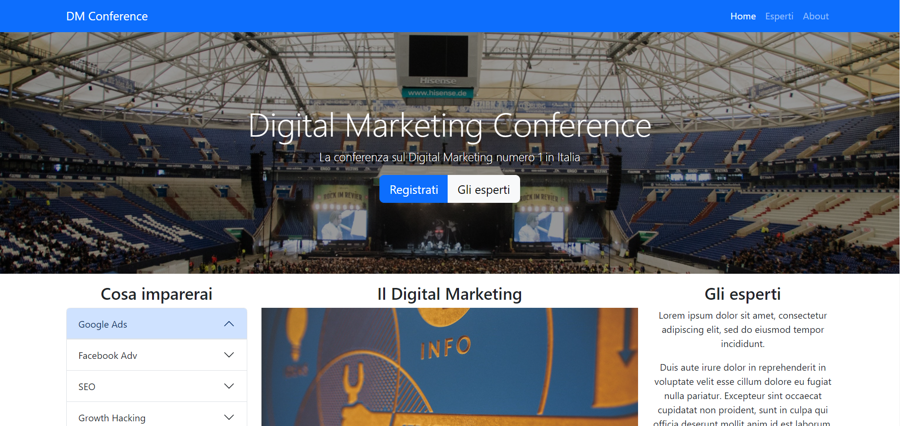
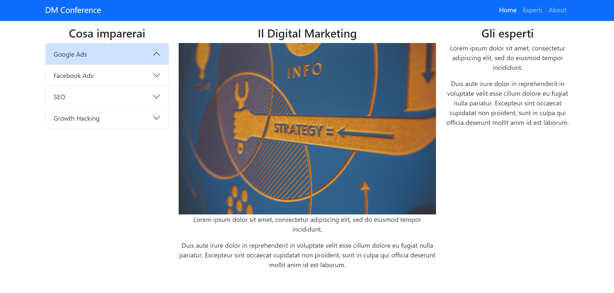
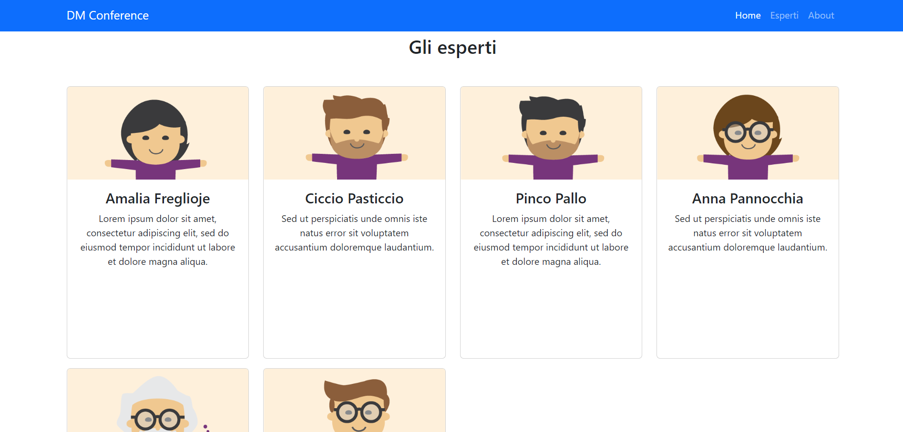
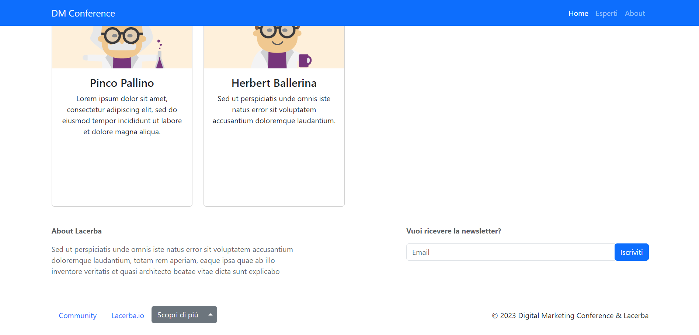

# Sito DM CONFERENCE

Questo progetto è un sito web che simula un evento, in questo caso una conferenza, realizzato interamente con bootstrap.

## Descrizione

Questo progetto è stato sviluppato con l'obiettivo di fornire una simulazione di un sito web, fornendo funzionalità front-end, è stato realizzato interamente con bootstrap ed è responsive: si adatta quindi a tablet e smartphone.

## Funzionalità

La web app include le seguenti funzionalità:

- iscrizione alla news letter
- Navigazione dei corsi disponibili su siti esterni
- Hamburger menù per smartphone
- bottoni a comparsa

## Tecnologie utilizzate

Questo sito web è stato sviluppato utilizzando le seguenti tecnologie:

- Bootstrap
- CSS

## Licenza

<!-- Questo progetto è stato rilasciato sotto la licenza MIT. Per ulteriori informazioni, leggere il file `LICENSE.md`. -->

## Crediti

Questo progetto è stato sviluppato da Katia Falletti.(https://it.linkedin.com/in/katia-falletti-616890225?trk=people-guest_people_search-card)
